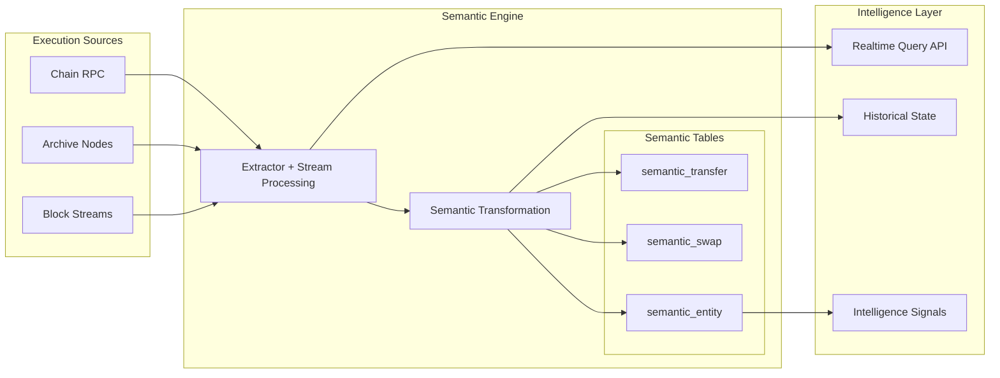

# Chainlake

### Semantic Data Platform for Onchain Intelligence

Chainlake is building a semantic data layer for blockchain systems — designed to transform raw onchain events into realtime, structured, queryable intelligence.

We focus on turning blockchain execution data into high-level semantic objects such as:

* transfers
* swaps
* liquidity events
* wallet behaviors
* protocol states

instead of exposing only raw logs, traces, or transaction payloads.

## Philosophy

Raw blockchain data is abundant.

Semantic understanding is scarce.

Chainlake exists to close that gap.

## Current Focus

Initial semantic coverage is being built around high-signal ecosystems where realtime data has immediate analytical value.

Priority is placed on making a small number of semantic tables deeply reliable before expanding chain coverage.

## Long-Term Vision

Chainlake evolves along this path:

> Extractor → Semantic Layer → Semantic State → Intelligence Layer

The final outcome is a reusable data substrate for next-generation onchain applications and AI systems.
